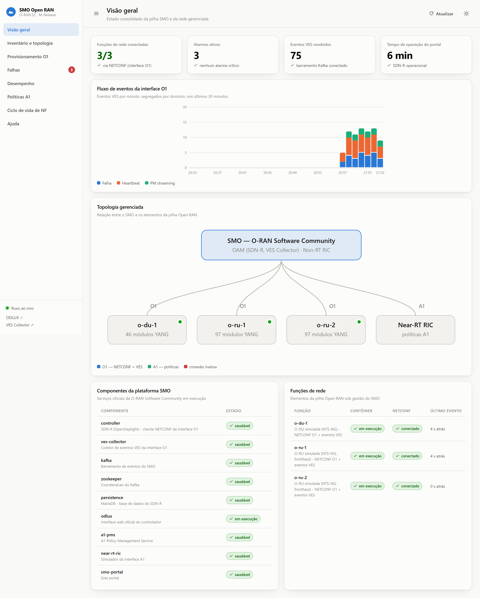
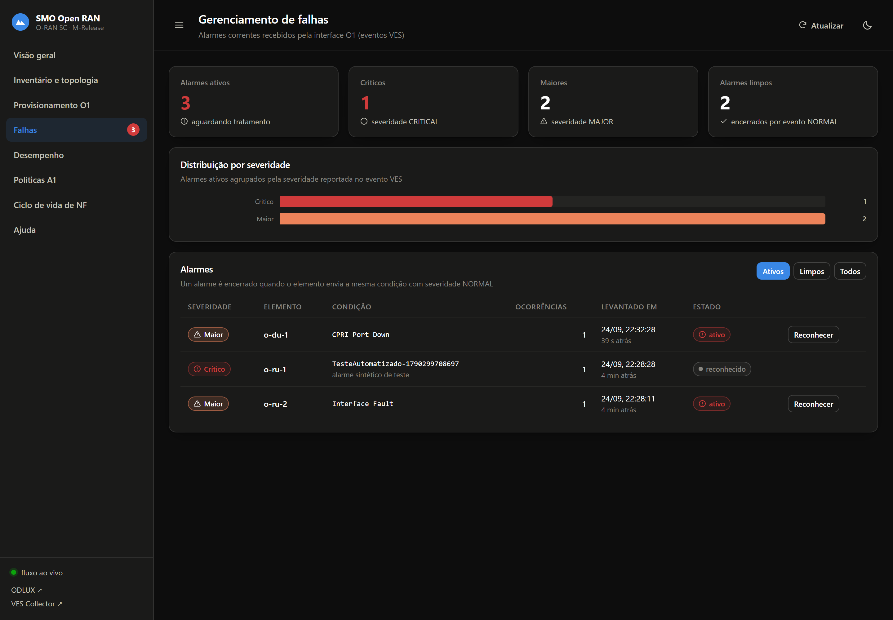

# SMO Open RAN — Provisionamento e gerenciamento de uma pilha Open RAN

Implementação da **Parte 2** do trabalho final da disciplina *Gestão, Orquestração e
Automação em Redes OpenRAN* — Especialização Open RAN / CPQD.

A Parte 1 selecionou o **SMO da O-RAN Software Community** (módulos OAM e Non-RT RIC)
como plataforma a ser implementada. Este repositório implanta essa plataforma a partir
dos **artefatos oficiais da OSC e do ONAP**, provisiona uma pilha Open RAN simulada
(um O-DU e dois O-RU) pela **interface O1**, aplica **políticas A1** através do
Non-RT RIC e oferece um **portal de operação** próprio sobre tudo isso.



---

## Índice

- [O que sobe](#o-que-sobe)
- [Requisitos](#requisitos)
- [Instalação](#instalação)
- [Acessos](#acessos)
- [Verificação end-to-end](#verificação-end-to-end)
- [Arquitetura](#arquitetura)
- [Procedência dos artefatos oficiais](#procedência-dos-artefatos-oficiais)
- [Simplificações deliberadas](#simplificações-deliberadas)
- [Desvios necessários em relação ao compose oficial](#desvios-necessários-em-relação-ao-compose-oficial)
- [O portal](#o-portal)
- [Diagnóstico](#diagnóstico)
- [Changelog](#changelog)
- [Estrutura do repositório](#estrutura-do-repositório)
- [Licença](#licença)

---

## O que sobe

| Camada | Serviço | Imagem | Origem |
|---|---|---|---|
| SMO / OAM | `controller` — SDN-R (OpenDaylight), cliente NETCONF da O1 | `oam-oam-controller/sdnr-image:13.0.1` | O-RAN SC |
| SMO / OAM | `odlux` — interface web oficial do controlador | `oam-oam-controller/sdnr-web-image:13.0.1` | O-RAN SC |
| SMO / OAM | `ves-collector` — ingestão de eventos da O1 | `dcaegen2.collectors.ves.vescollector:1.12.5` | ONAP |
| Mensageria | `kafka` + `zookeeper` — barramento de eventos | `strimzi/kafka:0.35.0-kafka-3.4.0` | Strimzi (versão fixada pela OSC) |
| Persistência | `persistence` — base do SDN-R | `mariadb:11.1.2` | versão fixada pela OSC |
| Rede gerenciada | `o-du-1` — O-DU simulada | `nts-ng-o-ran-du:1.8.1` | O-RAN SC (`sim-o1-interface`) |
| Rede gerenciada | `o-ru-1`, `o-ru-2` — O-RU fronthaul simuladas | `nts-ng-o-ran-ru-fh:1.8.1` | O-RAN SC (`sim-o1-interface`) |
| Non-RT RIC (perfil `a1`) | `a1-pms` — A1 Policy Management Service | `nonrtric-a1-policy-management-service:2.3.1` | O-RAN SC |
| Non-RT RIC (perfil `a1`) | `near-rt-ric` — simulador da interface A1 | `a1-simulator:2.2.0` | O-RAN SC |
| Operação | `smo-portal` — portal deste trabalho | construída localmente | este repositório |

Tudo que executa funções de SMO é software oficial. O único componente escrito aqui é
o portal, que **consome** as APIs dos demais — não as reimplementa.

## Requisitos

- Docker Engine 24+ com Docker Compose v2
- **8 GB de RAM disponíveis ao Docker** para a pilha completa (6 GB sem o perfil `a1`)
- ~12 GB de disco para as imagens
- Portas livres no host: `8080`, `8181`, `8282`, `8383`, `8484`, `8585`, `4334`

No Docker Desktop com WSL2, se a memória padrão for menor, crie `%UserProfile%\.wslconfig`:

```ini
[wsl2]
memory=10GB
```

e execute `wsl --shutdown` antes de subir a pilha.

## Instalação

```bash
git clone https://github.com/felipefavilla/smo-openran-parte2.git
cd smo-openran-parte2/deploy

# núcleo O1 + pilha Open RAN simulada + portal
./scripts/up.sh

# ou, incluindo o Non-RT RIC (interface A1)
./scripts/up.sh --with-a1
```

O script constrói as duas imagens locais, sobe a pilha na ordem certa e aguarda cada
camada ficar saudável, com indicação de progresso. A primeira execução baixa cerca de
5 GB de imagens.

> O **SDN-R leva de 3 a 5 minutos** para ficar saudável na primeira subida: o
> OpenDaylight carrega dezenas de bundles Karaf. É o passo mais demorado.

Para encerrar:

```bash
./scripts/down.sh            # preserva os volumes
./scripts/down.sh --purge    # remove também os volumes
```

## Acessos

| Interface | URL | Credenciais |
|---|---|---|
| **Portal SMO** | <http://localhost:8080> | — |
| ODLUX (oficial do SDN-R) | <http://localhost:8181> | `admin` / `admin` |
| RESTCONF do SDN-R | <http://localhost:8282/rests/data/…> | `admin` / `admin` |
| VES Collector | <http://localhost:8383> (eventos por `POST /eventListener/v7`) | `sample1` / `sample1` |
| A1 Policy Management Service | <http://localhost:8484/a1-policy/v2/…> | — |
| Near-RT RIC (simulador A1) | <http://localhost:8585/a1-p/…> | — |

## Verificação end-to-end

```bash
cd deploy
./scripts/status.sh     # contêineres, mountpoints NETCONF e tópicos VES
./scripts/demo.sh       # roteiro completo, passo a passo, com resultado de cada um
```

### Suíte de testes do portal

```bash
cd portal
npm install          # inclui puppeteer-core, usado pelos testes de interface
npm test             # 60 testes de API contra a pilha em execução
npm run test:ui      # 27 testes de interface num Chrome headless
npm run test:all     # ambos
```

Os testes não usam mocks: cada caso exercita o caminho real até o componente
oficial correspondente — RESTCONF do SDN-R, tópicos Kafka do VES Collector, A1
Policy Management Service e Docker Engine. Um teste que falha indica que o
portal e a pilha divergiram, não que um dublê ficou desatualizado.

Cobertura: saúde e arquivos estáticos, visão geral, inventário e classificação
de capacidades, provisionamento O1 (leitura, escrita e releitura de
confirmação), gerenciamento de falhas com injeção de evento VES, desempenho e
fluxo SSE, ciclo completo de política A1, e ciclo de vida de NF incluindo a
queda e o restabelecimento do mountpoint O1.

Os testes de interface exigem `puppeteer-core` e um Chrome instalado
(`CHROME_PATH` ajusta o caminho); sem eles a suíte é ignorada em vez de falhar.

### Roteiro de demonstração

`demo.sh` exercita os sete mecanismos que o trabalho pede e imprime o resultado de
cada um:

1. saúde de todos os serviços da pilha;
2. **O1 — descoberta**: elementos montados via NETCONF e quantos módulos YANG anunciam;
3. **O1 — provisionamento**: lê um ramo do datastore, grava uma alteração e confirma
   por releitura (`get-config` / `edit-config` reais);
4. **O1 — telemetria**: tópicos VES criados pelo coletor e consumo pelo portal;
5. **Gerenciamento de falhas**: injeta um evento VES de falha e acompanha até ele
   aparecer como alarme no portal;
6. **A1**: carrega um tipo de política no Near-RT RIC, cria uma instância pelo
   Non-RT RIC, confirma no próprio RIC e remove;
7. **Ciclo de vida de NF**: para uma função de rede, mostra o mountpoint O1 caindo,
   e a reinicia.

Saída esperada numa pilha saudável: **13 passos concluídos, 0 falhas**.

## Arquitetura

```
                       ┌──────────────────────────────────────────┐
                       │            Portal SMO (8080)             │
                       │  operação · telemetria · políticas · LCM │
                       └───┬───────────┬────────────┬─────────────┘
                 RESTCONF  │    Kafka  │      REST  │   Docker API
                           ▼           ▼            ▼
   ┌──────────────────────────┐  ┌───────────┐  ┌──────────────────┐
   │  SDN-R / OpenDaylight    │  │   Kafka   │  │  A1 Policy Mgmt  │
   │  cliente NETCONF da O1   │  │ (tópicos  │  │     Service      │
   │  + ODLUX (8181)          │  │   VES)    │  │      (8484)      │
   └────┬──────────────┬──────┘  └─────▲─────┘  └────────┬─────────┘
        │              │               │                 │ A1
        │ NETCONF      │ mountpoint-   │ publica         ▼
        │ (edit-config)│ registrar     │          ┌──────────────┐
        │              └───────────┐   │          │ Near-RT RIC  │
        ▼                          │   │          │  (sim, 8585) │
   ┌─────────────────────────┐     │  ┌┴──────────┴──┐
   │  o-du-1 · o-ru-1 · o-ru-2│────┼─▶│ VES Collector │
   │  (NTS-NG, interface O1)  │ VES│  │    (8383)     │
   └─────────────────────────┘     │  └───────────────┘
                                    └── registro de PNF
```

### Como um elemento entra sob gestão do SMO

1. A função de rede sobe e envia um evento **VES de registro de PNF** ao VES Collector.
2. O coletor valida o evento e o publica no tópico `unauthenticated.VES_PNFREG_OUTPUT`.
3. O **mountpoint-registrar** do SDN-R consome esse tópico e grava, no datastore de
   configuração do controlador, um nó NETCONF com endereço, porta e credenciais do
   elemento.
4. O OpenDaylight estabelece a sessão NETCONF, lê as capacidades YANG anunciadas e
   publica o mountpoint — o elemento passa a `connected`.
5. O portal detecta o novo elemento conectado e aplica o **perfil de provisionamento
   inicial** pela interface O1 (ver abaixo), fazendo a telemetria começar a fluir.

### Provisionamento inicial (dia 1)

Os simuladores NTS-NG sobem com o container `ves` do módulo `nts-network-function`
vazio: conectam pela O1 mas **não reportam nada**. Definir esses parâmetros é trabalho
de gerenciamento de configuração do SMO, e é assim que o portal o faz — três
`edit-config` pela interface O1, cada um seguido de releitura de confirmação:

| Item | Caminho YANG | Efeito |
|---|---|---|
| Telemetria VES | `nts-network-function:simulation/network-function/ves` | registro de PNF, heartbeat de 30 s, reporte de falhas |
| Notificações NETCONF | `.../network-function/netconf` | notificações de falha pelo canal NETCONF |
| Geração de falhas | `.../network-function/fault-generation` | cadência de emissão de alarmes, para exercitar o FM |

O resultado, elemento a elemento, é visível na tela **Provisionamento O1**, com o
código HTTP de cada etapa e um botão para reaplicar o perfil.

## Procedência dos artefatos oficiais

Os arquivos de configuração em `deploy/controller/`, `deploy/ves-collector/` e
`deploy/odlux/` foram copiados sem alteração funcional do repositório oficial
[`o-ran-sc/oam`](https://github.com/o-ran-sc/oam), commit registrado em
[`deploy/UPSTREAM_SHA.txt`](deploy/UPSTREAM_SHA.txt).

`deploy/a1-pms/config/application.yaml` vem de
[`o-ran-sc/nonrtric`](https://github.com/o-ran-sc/nonrtric),
`docker-compose/policy-service/config/`. O `application_configuration.json` ao lado é
próprio deste trabalho: declara o Near-RT RIC desta implantação e os elementos que ele
gerencia.

## Simplificações deliberadas

A distribuição oficial da OSC sobe cerca de vinte contêineres. Os itens abaixo foram
removidos por não pertencerem a nenhum ponto do objeto de estudo e por multiplicarem o
custo de implantação. Todos estão registrados como decisões, não como omissões:

| Removido | Por quê |
|---|---|
| Traefik (gateway TLS) | exige `/etc/hosts` e certificados; os serviços são expostos direto em portas do host |
| Keycloak + PostgreSQL (OIDC) | o controlador roda com `ENABLE_OAUTH=false` e autenticação básica do ODL |
| Servidor DHCP em macvlan | endereçamento de laboratório; o Compose já dá nomes e IPs estáveis |
| Node-RED, Jenkins, Wireshark | ferramentas auxiliares, fora do escopo |
| Grafana + InfluxDB | o portal cobre a visualização de telemetria com dois contêineres a menos |
| Clone dos esquemas 3GPP MnS no build do VES Collector | só valida eventos `stndDefined` 3GPP, que os simuladores não emitem; o Dockerfile oficial está preservado em `deploy/ves-collector/Dockerfile.official` |

Na mensageria, o Kafka roda com listener `PLAINTEXT` simples, sem SASL nem autorizador
OPA — não há multi-tenancy nem exposição externa nesta implantação.

## Desvios necessários em relação ao compose oficial

Quatro ajustes foram necessários para a pilha funcionar; cada um está comentado no
ponto correspondente do `docker-compose.yaml`:

1. **Healthcheck do controlador.** O compose oficial testa `/ready`, endpoint da camada
   SDNC do ONAP que não existe nesta imagem em modo `SDNRONLY`. A verificação usa o
   próprio RESTCONF da topologia NETCONF.
2. **NETCONF Call Home desativado nos simuladores.** Com Call Home *e* registro por VES
   ativos ao mesmo tempo, o mesmo dispositivo é montado duas vezes e o OpenDaylight
   falha com `Mount point already exists` e `ConflictingModificationAppliedException`,
   deixando o nó sem estado operacional. A implantação usa apenas o registro por VES —
   o fluxo O1 canônico da OSC. O controlador mantém a capacidade de Call Home ativa
   (porta 4334 exposta).
3. **`datastore-populate` desativado nos O-RU.** No NTS-NG 1.8.1 a geração aleatória de
   dados sofre falha de segmentação ao validar o módulo `o-ran-usermgmt`, derrubando o
   daemon que faz registro VES. Sem essa etapa o elemento sobe com os dados que
   acompanham a imagem. O O-DU mantém a etapa, que nele funciona.
4. **Healthchecks sem `curl`.** As imagens do A1 PMS e do ZooKeeper não trazem `curl`
   nem `wget`; as verificações usam `/dev/tcp` do bash.

## O portal

Backend em Node.js com **duas dependências** (`express` e `kafkajs`); frontend em
HTML/CSS/JS com módulos ES, **sem etapa de build e sem CDN** — funciona offline.
Os gráficos são SVG escritos à mão.

| Tela | Fonte de dados | O que evidencia |
|---|---|---|
| Visão geral | agregação de todas as fontes | arquitetura e serviços de SMO em operação |
| Inventário e topologia | RESTCONF `topology-netconf` | componentes O-RAN e descoberta de capacidade YANG |
| Provisionamento O1 | RESTCONF sobre `yang-ext:mount` | gerenciamento de configuração (`get-config`/`edit-config`) |
| Falhas | tópico VES `SEC_FAULT_OUTPUT` | gerenciamento de falhas |
| Desempenho | tópicos VES de medição e heartbeat | monitoramento e telemetria |
| Políticas A1 | A1 PMS + Near-RT RIC | Non-RT RIC e orquestração de políticas |
| Ciclo de vida de NF | Docker Engine API | ciclo de vida de Network Functions |
| Ajuda | estático | guia de apoio ao uso, embutido na aplicação |

O tema acompanha o sistema e pode ser alternado; a paleta de séries foi validada para
daltonismo e contraste nos dois modos. O fluxo de eventos chega ao navegador por SSE.



## Diagnóstico

**Nenhum elemento em Inventário.** Confirme que o controlador está saudável
(`docker compose ps controller`). O ciclo completo — registro de PNF, criação do
mountpoint, sessão NETCONF — leva de 1 a 2 minutos após cada simulador subir.
`./scripts/status.sh` mostra o estado de cada mountpoint.

**Nenhum evento em Desempenho.** O indicador no rodapé do menu lateral mostra o estado
do fluxo ao vivo. Verifique `docker compose logs kafka` e `docker compose logs
ves-collector`. Lembre-se de que os contadores do portal vivem em memória e zeram a cada
reinício do contêiner.

**Só uma instância do portal por vez.** O portal consome o Kafka com o *consumer group*
`smo-portal`. Uma segunda instância apontando ao mesmo broker divide as partições e
"rouba" mensagens da primeira.

**Tela de Políticas A1 indisponível.** O perfil A1 é opcional:
`docker compose --profile a1 up -d`.

**O portal parece não refletir uma mudança recente no código.** Os módulos são
servidos com revalidação obrigatória e o portal recarrega sozinho quando detecta
um build novo. Se ainda assim a tela parecer antiga, force a recarga com
Ctrl+Shift+R.

**`TimeoutNegativeWarning` nos logs do portal.** Vem do `kafkajs`
(`RequestQueue.scheduleCheckPendingRequests`), não deste código. O Node limita o valor a
1 ms e o consumo segue normal.

**Leitura devolve HTTP 409 `data-missing`.** O elemento anuncia o módulo YANG, mas não há
dado gravado naquele ramo. É esperado em ramos nunca populados — os caminhos sugeridos
no topo da tela de Provisionamento sempre existem.

**O VES Collector registra erro de `application_config.yaml`.** Ele tenta buscar
configuração dinâmica num Config Binding Service do ONAP que não existe aqui e recai na
configuração estática montada. O mesmo ocorre na implantação oficial; é inofensivo.

## Changelog

O histórico de mudanças está em [CLAUDE.md](CLAUDE.md).

## Estrutura do repositório

```
deploy/
  docker-compose.yaml      pilha completa, com o perfil opcional "a1"
  .env                     versões de imagem, credenciais e portas
  controller/              configuração oficial do SDN-R
  ves-collector/           Dockerfile e configuração oficial do VES Collector
  odlux/                   regras de proxy da interface oficial
  a1-pms/config/           configuração do A1 Policy Management Service
  scripts/                 up · down · status · demo
portal/
  server/                  API, clientes RESTCONF/Kafka/A1/Docker, reconciliador
  web/                     SPA sem build: telas, gráficos SVG, sistema de design
  test/                    suíte de testes de API e de interface
docs/
  Relatorio_Parte2_SMO_OpenRAN.docx/.pdf
  Apresentacao_Parte2_SMO_OpenRAN.pptx/.pdf
  img/                     capturas da execução real
```

## Licença

Apache-2.0 — a mesma licença dos artefatos da O-RAN Software Community e do ONAP
reutilizados aqui. Ver [LICENSE](LICENSE).
